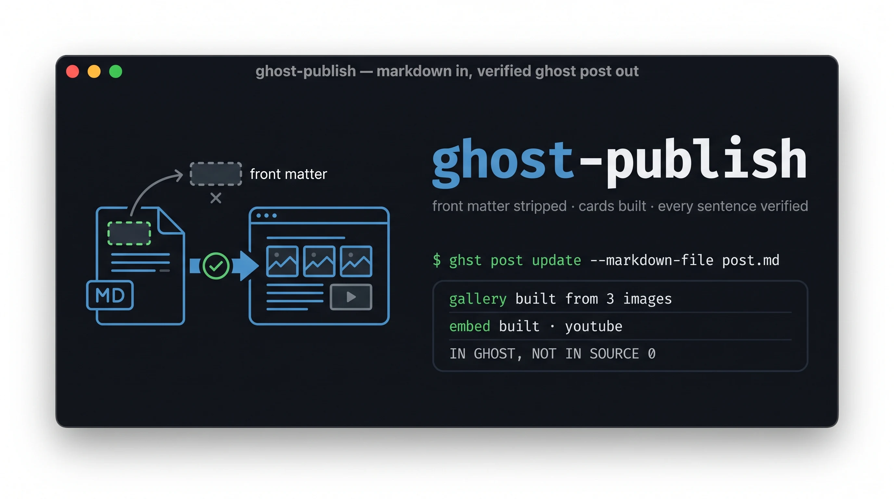

# ghost-publish



Get a markdown file onto a [Ghost](https://ghost.org) blog with the official `ghst` CLI, and
then **prove** that what arrived is what you sent.

Part of [claude-skills](../README.md).

## Why the proving is the point

`ghst post update` returns a clean JSON object whether or not the content arrived intact. Its
own output is not evidence. On the first real run of this workflow, a successful update left
YAML front matter rendered as visible text above the first paragraph of the post, and a
verification pass that checked sixteen expected strings reported **16/16** while it sat there.

A check that only asks *"is what I wanted present?"* is blind to everything that should not
be. So `verify_post.py` compares the whole document in both directions.

## What it does

- **Strips front matter before upload.** `--markdown-file` sends bytes verbatim and Ghost has
  no front-matter concept, so a leading `---` block becomes prose. `prepare_post.py` removes
  it and prints the `ghst` flags it implies (`--title`, `--excerpt`, `--tags`). A post's
  slug has no flag on `post create`, so `--payload` writes the `--from-json` payload that
  carries it; pages take `--slug` directly via `--target page`.
- **Strips the drafting scaffolding too**, which is not front matter and was the reason a
  duplicated title and an internal author note reached a public post. One leading H1, one
  author-note line, and a rule under either — only at the very top, every removal printed to
  stderr, and an italic line that does not match the known shape is kept and flagged rather
  than guessed at. `--keep-scaffolding` opts out.
- **Verifies both directions.** `verify_post.py` reports sentences in the source but missing
  from Ghost, *and* sentences in Ghost with no source — leaked front matter, editor edits, or
  an older draft still in place. It also asks a question the sentence diff cannot: it looks for
  an author note in the published text and an `h1` node among the first few, because scaffolding
  is content that *arrived* rather than content that went missing, and "did my post arrive" is
  blind to it.
- **Works on pages as well as posts.** A Ghost page holds the same Lexical document, so the
  same read-rewrite-push loop applies with `page` in place of `post` and `.pages[0]` in place
  of `.posts[0]`. Pages take `--slug` on create; posts do not.
- **Builds the two cards markdown can't express.** Ghost already makes image, quote, code,
  table and horizontal-rule cards from markdown. It never makes a **gallery** (consecutive
  images stay separate cards; the limit is nine, three to a row) or an **embed** from a bare
  video URL (that stays a link — the editor embeds on paste, the converter doesn't).
  `enrich_cards.py` rewrites both on the document Ghost produced, using Ghost's own `/oembed/`
  endpoint so nothing is fetched from a third party. A provider's pasted `<iframe>` — Bandcamp
  and friends — is left byte-for-byte alone, width and styling included.
- **Names the traps** that make a first run fail confusingly: `auth login` breaking behind an
  authenticating proxy, Ghost 301-ing to its own `url` unless it sees `X-Forwarded-Proto`,
  `post get` having no `html` field, and `post update` converting markdown to Lexical so the
  source is not recoverable afterwards.
- **Separates publishing from uploading.** Email fires on the publish transition, so
  `--newsletter` belongs on `publish`/`schedule`, never on `create`.

## What it does **not** do

- **It doesn't write or edit the prose.** Use `clear-and-human` for that.
- **It doesn't publish or schedule unless told to in the moment.** Scheduling with a
  newsletter attached emails real subscribers with no second confirmation. `status:` in front
  matter is deliberately *not* translated into a flag — publishing is a state transition, not
  a field in a file.
- **It doesn't configure Ghost, Docker, DNS or a reverse proxy.** If `ghst` can't reach the
  site that's infrastructure, and the skill says how to tell that apart from its own problem.
- **It doesn't parse all of YAML.** Flat `key: value` and inline lists only. Block lists,
  nested maps and multi-line scalars are reported as unparsed rather than guessed at.

## If your blog is behind an IdP

Cloudflare Access, Tailscale, Authelia, any SSO proxy — **`ghst` cannot authenticate through
it, and neither can this skill.** Neither is at fault: the IdP is refusing an unauthenticated
request, which is its entire purpose. Resolving it is the operator's side of the line.

The skill documents two routes, and the usual answer costs **one request header and changes no
security posture**: Ghost 301-redirects to its own configured `url` when it believes the
connection is insecure, so an internal request bounces back out through the front door. Give it
`X-Forwarded-Proto: https` in the reverse proxy that already fronts it and the internal path
works, with the IdP left fully in place on the public one.

What you should *not* do is punch a hole in the IdP before trying that. It was the first thing
I reached for and it turned out to be unnecessary — and one variant of it, an allow-list on a
dynamic residential IP, would have handed that bypass to a stranger the next time the address
was reassigned.

## Install

Three ways in, depending on what you want.

**As a standalone plugin** — this repo on its own:

```bash
claude plugin marketplace add kevin-burns/ghost-publish
claude plugin install ghost-publish@ghost-publish
```

**As part of the collection** — all the skills, one plugin:

```bash
claude plugin marketplace add kevin-burns/claude-skills
claude plugin install claude-skills@kevin-burns
```

**By hand**, if you would rather not use a marketplace: copy the `ghost-publish/` directory
into `~/.claude/skills/`. Everything the skill needs is inside it.

### Check it actually loaded

Do not take the install command's word for it. This repo has shipped three plugin manifests
that failed **silently** — one registered cleanly and listed zero plugins, another accepted
valid paths and loaded zero agents. Verify:

```bash
claude plugin details ghost-publish@ghost-publish
```

You want `Skills (1)  ghost-publish` under **Component inventory**. Zero means the manifest
registered and the skill did not load.

**A trap worth knowing:** `claude --safe-mode` disables plugin-provided skills, so a skill
installed this way will not appear in a safe-mode session. That is not a broken install.

Once loaded, the skill is namespaced as `ghost-publish:ghost-publish` — a copy placed directly in
`~/.claude/skills/` appears unnamespaced instead, and the two can coexist.

To remove it:

```bash
claude plugin uninstall ghost-publish@ghost-publish
claude plugin marketplace remove ghost-publish
```

## Requirements

`ghst` installed separately and already authenticating:

```bash
npm i -g @tryghost/ghst
export GHOST_URL="https://your-blog"
export GHOST_STAFF_ACCESS_TOKEN="{id}:{secret}"
ghst post list --json --jq '.posts[0].title'    # a title means you're connected
```

The scripts are **standard library only**, Python 3.12+, and never call Ghost — they read
files and compare them. The exception is `preflight.py`, which runs `ghst --version` locally
and still touches no network.

> **`ghst` is beta.** Behaviour here was verified against **0.16.6**. Several of the traps
> above are undocumented behaviours rather than promises, so re-check them after an upgrade.
>
> That pin is enforced rather than merely written down:
>
> ```bash
> python3 scripts/preflight.py            # warns on drift, names what to re-verify
> python3 scripts/preflight.py --strict   # for CI, where drift should stop the run
> ```
>
> It warns and does not block, because a check that fails the day `ghst` ships a patch is a
> check that gets deleted. Bump `VERIFIED` in that file only after re-running the four traps
> against the new release — the changelog will not mention them, since to Ghost they are not
> features.

## Usage

```bash
uv run ~/.claude/skills/ghost-publish/scripts/prepare_post.py post.md --out /tmp/body.md
ghst post update <post-id> --markdown-file /tmp/body.md --tags "Writing,Python" --json

ghst post get <post-id> --json --jq '.posts[0].lexical' > /tmp/lexical.json
uv run ~/.claude/skills/ghost-publish/scripts/verify_post.py /tmp/body.md /tmp/lexical.json
```

Metadata lives outside the body and is checked separately:

```bash
ghst post get <post-id> --json \
  --jq '.posts[0] | {status, slug, tags: [.tags[]?.name], feature_image}'
```

## Testing

```bash
cd ghost-publish && python3 -m pytest tests -q
```

43 tests. Two are regressions from running the verifier against a real 4,500-word post rather
than fixtures: Lexical splits formatted spans into separate text nodes (which made every italic
look like an edit), and `_` was stripped as an emphasis marker (which turned
`fidelity_check.py` into a difference).

The card shapes are pinned against a post **built by hand in Ghost's own editor** and read
back, not inferred from Ghost's TypeScript definitions — those give field names but not the
serialised form, and two details would have been guessed wrong: a gallery row holds three
images, and a gallery image's `fileName` is the original upload name while `src` may carry a
`-1` deduplication suffix that the filename does not.

## Provenance

Wraps [`ghst`](https://github.com/TryGhost/ghst) (TryGhost, MIT). No credentials are bundled
or stored. Not affiliated with or endorsed by Ghost.
